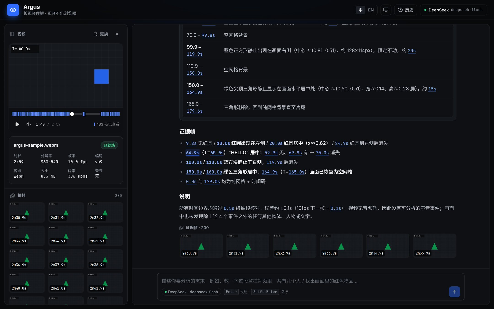
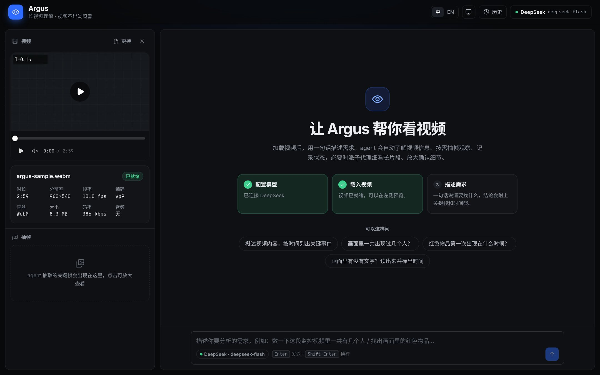
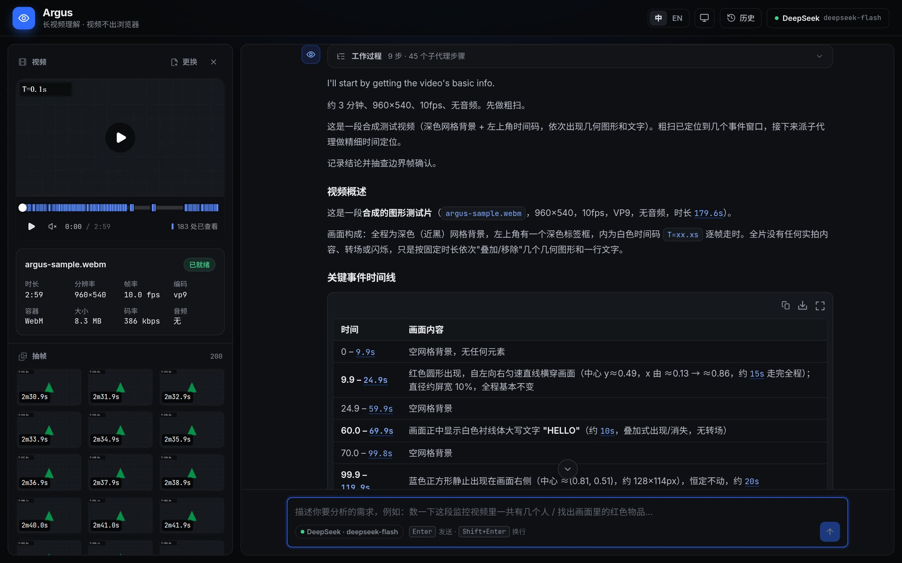
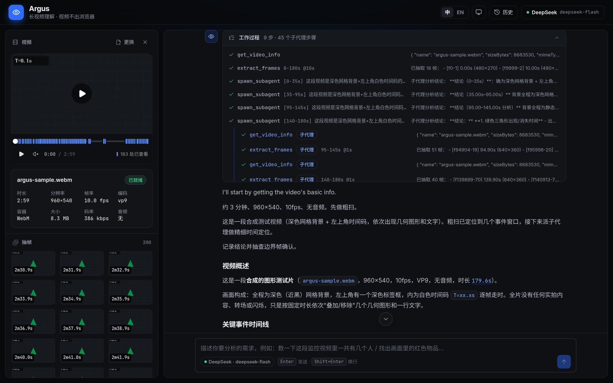
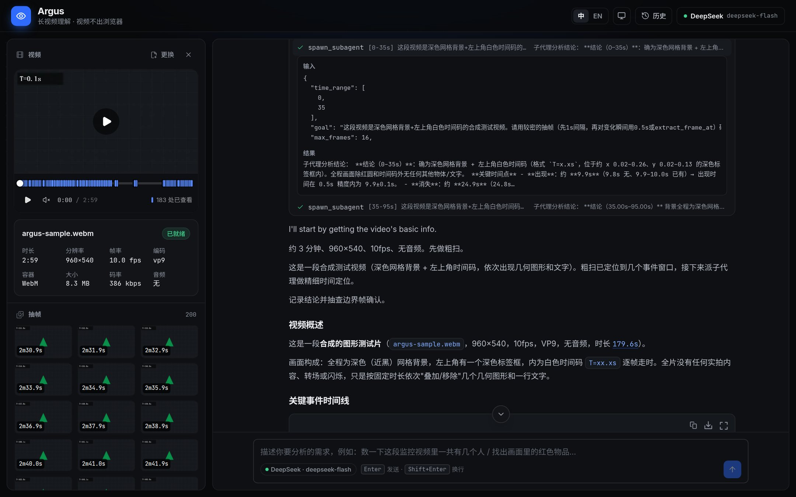
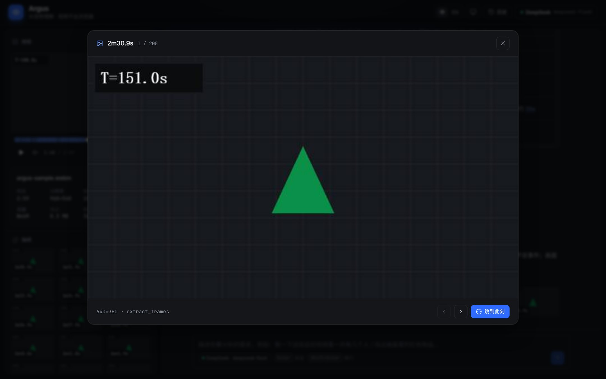
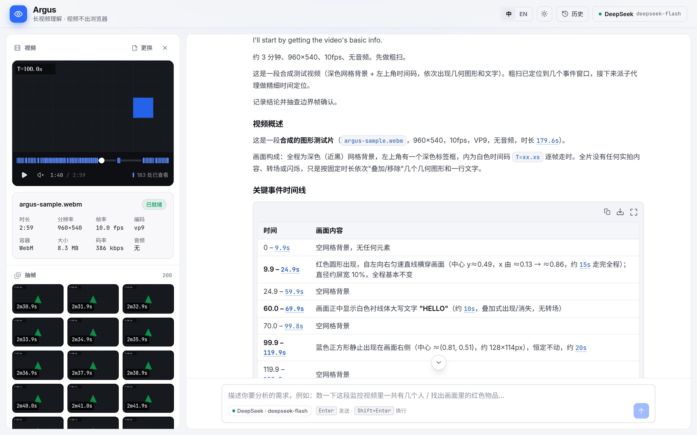
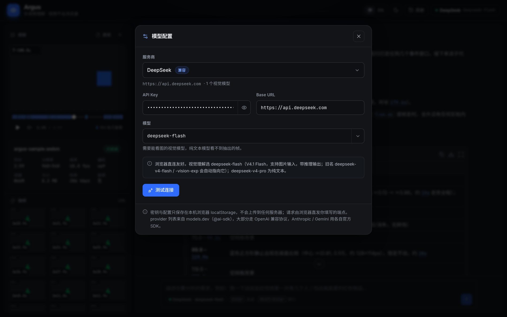
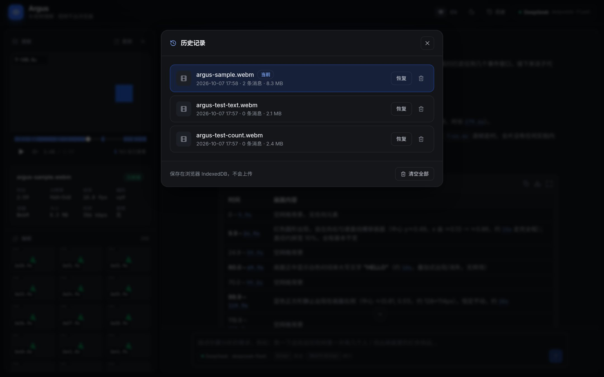

<div align="center">

# Argus

**前端本地的长视频理解 Agent Harness —— 视频不出浏览器，结论必带证据**

Frontend-local long-video understanding agent harness. No backend, no uploads — your video never leaves the browser.

[](https://github.com/YouToco/argus/actions/workflows/deploy.yml)
[](LICENSE)
[](https://react.dev)
[](https://ai-sdk.dev)

[在线体验](https://argus.zhuoqidev.com) · [快速开始](#快速开始) · [工作原理](#工作原理) · [测试](#测试)

</div>

---

名字取自希腊神话百眼巨人 **Argus Panoptes**（全视守望者）。你给 Argus 一段本地视频和一句话需求——"数一下这段监控里有几个人""找出红色物品出现的时间"——它会自己规划抽帧策略、逐段观察、记录状态、必要时派子代理细看，最后给出**带关键帧时间戳证据**的结论。



## 特性

- **纯前端、零后端**：视频经本地 Object URL 加载，文件从不上传。MP4 / MOV / MKV / WebM 走 mediabunny（WebCodecs 硬解顺序抽帧）；AVI / WMV / FLV / TS 等浏览器解不了的格式，首次拖入时按需懒加载 ffmpeg.wasm（约 32MB，从 unpkg/jsdelivr 直取，不入本仓库）在浏览器内转码为 H.264 MP4 后进入同一管线——用户无需安装任何东西。
- **BYOK 多 provider**：基于 [Vercel AI SDK](https://ai-sdk.dev)，一套代码支持 OpenAI 兼容端点（OpenRouter / DeepSeek / Kimi / 智谱 / Ollama …）、Anthropic、Gemini；填完 API Key **自动拉取端点模型列表**，下拉即选。
- **专业 Agent 工作流**：粗扫 → 锁定区间 → 加密细看 → 放大确认的分层策略；`remember/recall` 状态记忆防长上下文遗忘；`spawn_subagent` 把长片段派给子代理并行细看。
- **证据一点就到**：左侧内置预览播放器，时间轴标出 agent 看过的每一帧；回答里的时间戳（`24.8s`、`1:05`、`1m30s`）和证据帧点一下就跳到那一刻，帧图可放大、用 ←/→ 逐张翻看。
- **过程可视化**：回答上方是可折叠的工作过程区——每个工具调用的参数摘要、结果、状态一目了然，子代理步骤嵌套展示；回答用 Markdown 渲染。
- **上手零门槛**：空状态给出「配置模型 → 载入视频 → 描述需求」三步引导和示例问题；手边没视频可一键载入示例视频。
- **深色 / 浅色主题 + 中英双语**：主题可跟随系统或手动切换，界面文案全部随语言切换；移动端布局可用。
- **首屏轻量**：AI SDK 与各 provider、mediabunny、Markdown 渲染（streamdown + Shiki）都按需加载，首屏 JS gzip 约 95KB。
- **本地持久化**：分析会话（对话 / 帧 / 记忆）自动存入 IndexedDB，刷新不丢；历史记录支持单条恢复、单条删除、一键清空。
- **长视频内存治理**：内存只保留最近 200 帧（旧帧从 IndexedDB 懒加载）；发给模型的上下文只保留最近 3 批帧图，更早的替换为可回查的文字指针——小时级视频不会撑爆标签页内存或上下文窗口。
- **凭证不出本机**：API Key 只存浏览器 localStorage，请求由浏览器直发你填写的端点。

## 使用过程

> 下面的截图都来自一次真实分析：DeepSeek `deepseek-flash` 看仓库自带的 3 分钟示例视频（不到 2 分钟跑完，花费约 ¥0.2）。

| 上手引导（三步 + 示例问题） | 分析回答（Markdown 表格 + 可点时间戳） |
| --- | --- |
|  |  |

| 工作过程区（主代理 9 步 + 子代理 45 步可审计） | 子代理派发与回报（入参 / 结论） |
| --- | --- |
|  |  |

| 证据帧放大（←/→ 翻看、跳到此刻） | 浅色主题 |
| --- | --- |
|  |  |

| 模型配置（自动拉取模型列表） | 历史记录（恢复 / 单删 / 清空） |
| --- | --- |
|  |  |

## 快速开始

**在线版**：打开 [argus.zhuoqidev.com](https://argus.zhuoqidev.com)，右上角「配置模型」填入任意 provider 的 API Key，左侧拖入本地视频（或点「用示例视频试试」）即可。

**本地开发**：

```bash
npm install
npm run dev        # Vite 开发服务器
npm test           # vitest 单元测试
npm run typecheck  # tsc --noEmit
npm run build      # 类型检查 + 生产构建（产物在 dist/）
```

推荐使用带视觉能力的模型（如 `deepseek-flash`、`gemini-3.8-flash`、`claude-sonnet-5-5`、`qwen3.8-flash`）——纯文本模型看不到帧图，无法完成分析。

## 工作原理

```
用户需求 → 主 Agent（系统提示 + 工具集）
  ├─ get_video_info    容器/编码/时长/分辨率/帧率（mediabunny 原生读取，兜底 mediainfo.js WASM）
  ├─ extract_frames    按【时间范围 + 间隔】批量抽帧（精度/数量可控）
  ├─ extract_frame_at  抽指定瞬间单帧
  ├─ list_frames       列出已抽帧及 id
  ├─ inspect_region    放大某帧局部区域（确认远处物体细节）
  ├─ remember / recall 时间段观察结论的写入与回读（状态工具）
  └─ spawn_subagent    把某时间段的细看派给子代理 → 返回精简结论
         └─ 子代理继承除 spawn 外的全部工具，独立抽帧观察
```

每轮工具产出的帧图注入对话供模型直接观察；旧帧图在上下文中按批裁剪（保留最近 3 批），模型随时可通过 `list_frames` / `extract_frame_at` 回查任意帧。

## 测试

- **单元测试**：`npm test`（vitest）—— 记忆存储、上下文帧图裁剪等核心逻辑。
- **真值视频集**：`public/gen-test-video.html` 可在浏览器里一键生成 5 段带精确真值的合成视频（物体运动 / 计数变化 / OCR / 1 秒瞬态事件 / 3 分钟稀疏事件），用于端到端验证 agent 的真实理解力——本项目所有结论都对真值验证过（计数变化边界 0.1s 级、180s 稀疏事件全召回零幻觉、4 子代理并行编排）。

## 隐私

视频文件、API Key、分析记录全部留在本机（localStorage + IndexedDB）；唯一的网络请求是从浏览器直发你配置的 LLM 端点。清空历史记录即彻底删除本地数据。

## License

[MIT](LICENSE)